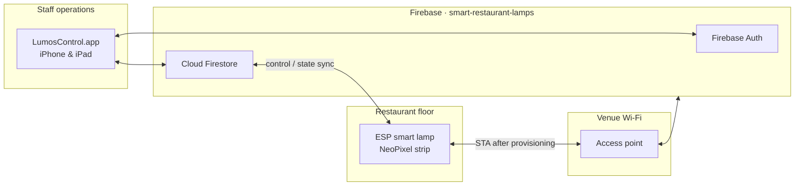

<div align="center">

# Lumos Control
### Smart IoT Restaurant Table & Lighting Management System

[](#system-architecture)
[](#hardware--firmware-specifications)
[](#hardware--firmware-specifications)
[](#software-applications)
[](#interactive-neopixel-ambiance-engine)
[](#commercialization-licensing--partnership-opportunities)

**Turn every table into a connected service station — reservation, waiter call, kitchen status, and cinematic ambient light, orchestrated from a single staff terminal.**

[Partnership Inquiry](#commercialization-licensing--partnership-opportunities) · [Architecture](#system-architecture) · [Setup](#installation-hardware-setup--flashing) · [Creator](#author)

</div>

---

## Product Overview

**Lumos Control** is a market-ready **B2B IoT platform** for restaurants, cafés, and hospitality venues. Each table hosts a networked smart lamp: addressable NeoPixel lighting for atmosphere, plus a live operational channel for floor staff.

The system in this repository is a **fully functional commercial control plane**:

- Table-side **ESP-class smart lamps** join the venue Wi-Fi after a one-time SoftAP provisioning flow.
- A **native Apple staff application** (SwiftUI, iPhone and iPad) authenticates operators, maps every lamp to a table, and pushes lighting and service commands in real time.
- **Firebase Authentication** and **Cloud Firestore** provide the multi-tenant restaurant backend — live lamp state, waiter calls, reservations, staff invitations, and subscription-aware venue records.

> **Global partnership & co-founding call.** Artin Zomorodian (آرتین زمردیان) is seeking distributors, marketers, and hospitality-tech operators worldwide. Engineering — firmware, hardware adaptation, white-label software, and Android — stays with the inventor. Local sales, installation, and marketing stay with the partner. See [Partnership Opportunities](#commercialization-licensing--partnership-opportunities).

---

## Core Hardware & Smart Lighting Features

### Smart Table Operations

Each lamp is bound to a table (`tableName`, `tableNumber`) and publishes a live `state` document that the floor app observes without polling.

| Capability | What staff see | Data contract |
| --- | --- | --- |
| **Reservation status** | One-tap **Reserved / Available** on the lamp detail screen. Reserved tables lock live lighting controls so ambiance cannot be changed mid-booking. | `state.tableStatus` → `reserved` \| `available` |
| **Digital waiter call** | A raised-hand indicator appears on the table grid when a guest calls. Staff clear the call from the list. | `state.callStatus` → `calling` \| `none` |
| **Kitchen / food-readiness channel** | The same live table-status pipe carries operational updates from kitchen to floor (food ready, in preparation, or custom venue states) so lighting and the staff grid stay in sync. | Extensible `state.tableStatus` string on the lamp document |
| **Device health** | Online/offline LED, last-seen timestamp, and low-battery warning below 20%. | `state.isOnline`, `state.lastSeen`, `state.batteryPercent` |

Venue owners also assign **table identity** (name and number) per lamp and can factory-reset a device by issuing a `Hard_Reset!` control effect before the cloud record is removed.

### Interactive NeoPixel Ambiance Engine

Lighting is not a decorative extra — it is a programmable **ambiance engine**. The staff app writes a `control` payload; firmware renders it on WS2812B / SK6812 addressable LEDs with non-blocking animation timing so Wi-Fi keep-alives and guest calls never stall the strip.

| Staff mode | Firmware `effect` token | Intent |
| --- | --- | --- |
| **Custom brand color / static theme** | `static` | Solid RGB from the in-app color picker (`control.color`, hex) at `control.brightness` 0–100. Default factory theme: `#FFFFFF` @ 80%. |
| **Romantic candle flicker** | `candle` / `flicker` | Warm, irregular luminance for intimate dining. |
| **Smooth rainbow wave** | `rainbow` | Continuous hue travel across the strip for lounge and event service. |
| **Music / beat-reactive pulse** | `pulse` | Rhythmic brightness envelope for bars, live nights, and brand activations. |

All lamps on a venue share the same Wi-Fi fabric. The SwiftUI terminal applies per-table control or walks the live grid — **batch operations at venue scale** from one authenticated session, with 500 ms debounced writes so slider and color-picker gestures do not flood the bus.

---

## System Architecture

Lumos Control is a **cloud-synchronized, locally provisioned** IoT stack. Lamps never require a tethered USB session after first setup. Staff devices do not speak a proprietary LAN protocol at runtime; they subscribe to Firestore and the lamps follow.

```
┌─────────────────────────────────┐         ┌──────────────────────┐         ┌──────────────────────────────────┐
│  ESP Smart Lamp + NeoPixels     │         │  Venue Wi-Fi LAN     │         │  Apple Staff Terminal             │
│  SoftAP · WS2812B/SK6812 · AVR  │ ◄─────► │  Local access point  │ ◄─────► │  SwiftUI · iPhone / iPad          │
│  GET /device_id  POST /configure│         │                      │         │  (tablets on the pass & floor)   │
└─────────────────────────────────┘         └──────────┬───────────┘         └────────────────┬─────────────────┘
                                                       │                                      │
                                                       │     ┌────────────────────────────────▼─────────────────┐
                                                       └────►│  Firebase Cloud                                    │
                                                             │  Auth  ·  Firestore (restaurants / lamps / users) │
                                                             └────────────────────────────────────────────────────┘
```



### Runtime data path

1. **Provision (once).** The lamp boots a SoftAP named `Lumos-Setup-…` at **`http://192.168.4.1`**. The staff app (or a technician phone) POSTs venue Wi-Fi credentials and `restaurant_id`.
2. **Join.** Firmware leaves SoftAP, associates with the venue SSID, and registers itself under `restaurants/{restaurantId}/lamps`.
3. **Operate.** The app attaches a Firestore snapshot listener. Guest call buttons, reservation toggles, color, brightness, and effect writes merge into `state` / `control`. Firmware consumes `control` and publishes telemetry into `state`.

### Multi-tenant identity

| Role | Onboarding | Access |
| --- | --- | --- |
| **Owner** | Signs up as `owner`, then creates the restaurant (name, address, phone). The new venue is linked to their user profile. | Full lamp grid, provisioning, invitations, lighting, reservations. |
| **Admin** | Invited by the owner via email. | Operational control of the venue lamps. |
| **Waiter / staff** | Signs up as `waiter`, waits for an invitation, then accepts. | Floor grid, waiter-call clear, table status. |

Invitation records live in a top-level `invitations` collection (`pending` → `accepted`) and bind `users/{uid}.restaurantId` + `role` in a single batched write.

---

## Hardware & Firmware Specifications

Firmware binaries and schematic packages are delivered to manufacturing and distribution partners. This repository publishes the **control-plane contract** the hardware must implement.

### Bill of materials (commercial lamp)

| Assembly | Specification | Role |
| --- | --- | --- |
| **Wi-Fi SoC** | ESP-family module (2.4 GHz, SoftAP + STA) | Captive provisioning AP, HTTPS/TLS session to Firebase, lamp identity (`device_id`). |
| **Lighting MCU** | AVR core programmed with **CodeVisionAVR / C** | Deterministic, non-blocking WS2812B / SK6812 bit timing and animation state machine. |
| **LED array** | Addressable **NeoPixel** strip or ring — **WS2812B** or **SK6812** (RGB / RGBW) | Guest-facing ambiance; brightness scaled 0–100 from cloud `control`. |
| **Power** | 5 V regulated rail sized for LED peak current + RF; battery telemetry optional | `state.batteryPercent` is first-class in the lamp document (low-battery UI at &lt; 20%). |
| **Mechanics** | Custom hospitality casing (table lamp / pendant / under-liner) | OEM-ready; CAD and material changes are part of partner hardware adaptation. |
| **Identity** | Unique `deviceId` exposed on `GET /device_id` | Bound to `restaurants/{id}/lamps` at first successful cloud registration. |

### Firmware behavior

- **Non-blocking loop.** LED frames and Wi-Fi / Firestore I/O are scheduled independently so a rainbow cycle cannot delay a waiter-call publish.
- **Provisioning HTTP API** (SoftAP, no TLS on the setup LAN — ATS `NSAllowsArbitraryLoads` is enabled in the app for this hop only):

  | Method | Path | Body / response |
  | --- | --- | --- |
  | `GET` | `/device_id` | `{ "device_id": "<unique>" }` |
  | `POST` | `/configure` | `{ "ssid": "<venue>", "password": "<psk>", "restaurant_id": "<id>" }` → `{ "status": "success" }` |

- **Control plane.** Firmware watches `control.brightness`, `control.color`, `control.effect`. Token `Hard_Reset!` triggers local wipe; the cloud document is deleted after a 10-second settle so the device can leave the fleet cleanly.
- **Telemetry.** `state.isOnline`, `state.lastSeen`, `state.batteryPercent`, `state.tableStatus`, `state.callStatus`.

### Lamp document (Firestore)

```
restaurants/{restaurantId}/lamps/{lampId}
├── deviceId, restaurantId, tableName, tableNumber, createdAt
├── state    { batteryPercent, isOnline, lastSeen, tableStatus, callStatus }
└── control  { brightness, color, effect }
```

New lamps are created with `tableName = "New Table"`, `tableNumber = 0`, brightness `80`, color `#FFFFFF`, effect `static`, then renamed from **Edit Lamp**.

---

## Software Applications

### Native Apple staff terminal (shipping)

The application in this repository — **LumosControl** (`com.ajirak-bms.LumosControl`, marketing version **1.0**) — is a **native SwiftUI** client for **iPhone and iPad** (deployment target **iOS / iPadOS 18.5+**). It is the restaurant’s management terminal: owners and floor staff run it on pocket devices and on pass-station tablets.

| Module | Responsibility |
| --- | --- |
| `AuthService` | Firebase Auth session + live `users/{uid}` profile listener. |
| `FirestoreServices` | Restaurant CRUD, lamp listen/update/delete, invitations, waiter-call clear, reservation writes. |
| `DeviceProvisioningService` | SoftAP client against `192.168.4.1`. |
| `WiFiManager` | Optional `NEHotspotConfiguration` join to `Lumos-Setup*` (Debug currently uses `MANUAL_WIFI`: staff join the lamp SSID from iOS Settings). |
| `LampsViewModel` | Snapshot-driven table grid. |
| `AddLampViewModel` | Guided three-step (or two-step manual) commissioning. |

**Operator workflows already in product:**

- Sign in / sign up (owner or waiter).
- Create restaurant (owners with no `restaurantId` yet).
- Accept pending invitations (staff).
- Live **Lamps Control** grid: online LED, reserved bookmark, waiter-call button, low battery.
- Per-table **Live Control**: color picker, brightness slider, effect picker — disabled while reserved.
- Invite teammates by email as **Waiter** or **Admin**.
- Commission a new lamp onto the venue SSID.
- Edit table name/number; swipe-to-delete with hardware reset handshake.

Localization is already in the floor UI (including Armenian table labels), which is the same pipeline used for partner-market translation.

**Backend:** Firebase iOS SDK **12.2.0** (`FirebaseAuth`, `FirebaseFirestore`), project **`smart-restaurant-lamps`**. Entitlement `com.apple.external-accessory.wireless-configuration` supports programmatic hotspot join when `MANUAL_WIFI` is off.

### macOS desktop & Android (on request)

The current Xcode target is **iPhone + iPad**. A **native macOS** management console (Swift / AppKit or a Mac Catalyst companion) and a **white-label Android** staff app are scoped as partnership deliverables: same Firestore contracts, localized UI, and optional local-cloud substitution. See [Partnership](#commercialization-licensing--partnership-opportunities).

---

## Commercialization, Licensing & Partnership Opportunities

Lumos Control is offered as a **territory partnership**, not a boxed consumer gadget.

**Artin Zomorodian** remains Chief Hardware/Software Architect: the person who designed the lamp, the firmware contract, and the staff application. He is actively seeking **global business partners, distributors, and marketers** — entrepreneurs, hospitality-tech agencies, and sales organizations who already reach restaurants, hotel groups, and café chains.

### Division of responsibility

| Artin / engineering | Partner / market |
| --- | --- |
| Custom firmware (effects, timings, radio, power) | Local sales, demos, and venue onboarding |
| Hardware redesign for local mains, certification, and casing | Distribution, inventory, and installer network |
| Software **white-labeling** (brand, bundle ID, store presence) | Marketing, pricing, and hospitality relationships |
| **Android** staff app and **macOS** back-office console | Training floor managers and wait staff |
| Localized UI translation and RTL/LTR adaptation | In-country support desk (L1) |
| Local cloud / private server adaptation when Firebase is not the right fit | Contracts, invoicing, and territorial exclusivity talks |
| Ongoing engineering support and feature roadmap | Feedback from real dining rooms |

If you can sell and support hospitality IoT in your country, the product can be **adapted to your market** rather than imported as a fixed SKU.

**Start a conversation:** [github.com/azomorodian](https://github.com/azomorodian) · repository [LumosControl](https://github.com/azomorodian/LumosControl)

---

## Installation, Hardware Setup & Flashing

### 1. Flash the ESP / AVR firmware

Companion firmware is supplied to manufacturing partners (CodeVisionAVR project for the lighting engine, C/C++ image for the ESP Wi-Fi SoC). Typical production line:

1. Program the AVR lighting MCU from CodeVisionAVR (release HEX, fuse bits per the hardware package).
2. Flash the ESP module over UART (bootloader, then application image that implements SoftAP + Firestore client).
3. Power the lamp on a current-limited 5 V bench supply and confirm the SoftAP SSID `Lumos-Setup-…` appears.
4. Smoke-test `GET http://192.168.4.1/device_id` from any HTTP client on that AP.

Do not connect the LED rail to an undersized USB port; addressable strips need a dedicated 5 V supply and common ground with the SoC.

### 2. Commission the lamp onto a restaurant

1. Create the venue in the app (owner sign-up → **Create Your Restaurant**).
2. On the commissioning phone, join **`Lumos-Setup-…`** from iOS **Settings → Wi-Fi** (manual path used in the current Debug configuration).
3. Open **Add New Lamp**, enter the **restaurant Wi-Fi SSID and password**, and tap **Start Lamp Setup**.
4. The app `POST`s `{ ssid, password, restaurant_id }` to `/configure`. On `status: success`, the lamp leaves SoftAP, joins the venue network, and appears in **Lamps Control** once it registers.

### 3. Build and launch the staff application

**Requirements:** macOS with **Xcode**, Apple Developer signing (team used in-tree: development team on the LumosControl target), iOS / iPadOS **18.5+** device or simulator, and a Firebase iOS app whose `BUNDLE_ID` is `com.ajirak-bms.LumosControl` (or your white-label ID).

```text
1. Clone  git clone https://github.com/azomorodian/LumosControl.git
2. Copy   GoogleService-Info.plist.example → GoogleService-Info.plist
          and fill in values from your Firebase Console (iOS app).
          Do not commit GoogleService-Info.plist — it is gitignored.
3. Open   LumosControl.xcodeproj
4. Select the LumosControl scheme, a connected iPhone or iPad, and Run.
5. Sign up as Restaurant Owner, create the venue, then provision lamps.
```

Swift Package Manager resolves **firebase-ios-sdk 12.2.0** automatically. Debug builds define `MANUAL_WIFI` so SSID detection via `NEHotspotNetwork` is optional; staff type the venue SSID when commissioning.

**First-run path**

```
LoginView
  ├─ owner + no restaurant  → CreateRestaurantView
  ├─ restaurantId present   → LampsListView  (live grid)
  └─ staff, unassigned      → PendingInvitationView
```

---

## Repository Map

```text
LumosControl/
├── LumosControl/                 SwiftUI scenes (login, grid, detail, provisioning, invitations)
├── Models/                       Lamp, Restaurant, UserProfile, Invitation, provisioning DTOs
├── ViewModels/                   LampsViewModel, AddLampViewModel
├── Services/                     Auth, Firestore, SoftAP provisioning, Wi-Fi helper
├── LumosControlTests/            Unit test target
├── LumosControlUITests/          UI test target
├── GoogleService-Info.plist.example   Firebase template (no secrets)
└── LumosControl.xcodeproj             Xcode project (iPhone + iPad)
```

---

## Author

**Artin Zomorodian** (آرتین زمردیان)  
Creator & Chief Hardware/Software Architect  

[github.com/azomorodian](https://github.com/azomorodian)

Lumos Control is a hospitality IoT product: engineered end-to-end, ready to white-label, and looking for the operators who will take it into dining rooms worldwide.

---

<div align="center">

*Table light. Service signal. Brand atmosphere. One network.*

</div>
